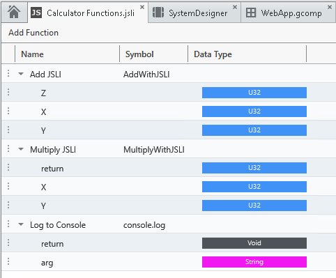
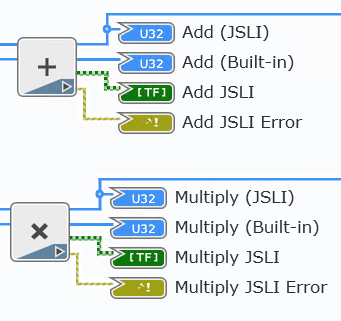
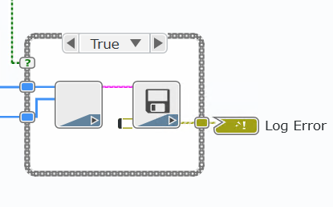

# Call JavaScript From a WebVI (Requires NXG 3 Beta)

**Note: JSLI examples can only be used with the NXG 3 Beta. To access the NXG 3 Beta visit: [ni.com/techpreview](https://ni.com/techpreview)**

This example is a simple 4-bit calculator using the JavaScript Library Interface (JSLI). The math functions and Log to Console button illustrate different methods of using the JSLI. Add (JSLI) and Multiply (JSLI) use external JavaScript files to implement their functions. The Log to Console button logs text to the browser debug console using the browser-supported console.log function. After building and deploying the WebVI to a browser, open the browser developer tools (Press F12 in most browsers) and select the Console tab to view the console log.

On the panel, this WebVI has X and Y binary inputs. The user clicks these to change the numerical values of the inputs. The Outputs of X+Y and X*Y are updated with binary and numerical indicators. 

# Dependencies
- LabVIEW NXG 3.0 Web Module

# Setup
1. Clone the [ni/webvi-examples](https://github.com/ni/webvi-examples) repository to your machine.
2. Open `CallJavaScriptFromAWebVI\CallJavaScriptFromAWebVI.lvproject`
3. Open `Main.gviweb` and click the **Run** button.
4. Build the web application.  
  a. Open `WebApp.gcomp`.  
  b. On the **Document** tab, click **Build**.

**Note:** To view the build output on your machine, click **Locate Directory in Windows Explorer** on the **Document** tab once your application finishes building. You can automatically launch and view the Web application locally by going to **System Designer** >> **Web Server** >> right-click **WebApp.gcomp** >> **Run**

# Hosting
You can manually the move the build output found at `\CallJavaScriptFromAWebVI\Builds` to any web server. This project also includes a Distribution (WebApp.lvdist) that can be used to build a package (.nipkg). Packages utilize NI Package Manager to automated the process of installing, upgrading, or removing the web app. A package is also a requirement for hosting a Web application on SystemLink Cloud.

## SystemLink Cloud Web App Hosting
The following steps can be used to host the web app on SystemLink Cloud
1. Open `CallJavaScriptFromAWebVI.lvproject`.
2. Open `WebApp.lvdist`.
3. Click the build icon in the top command bar of this distribution document
4. Open a Web browser and navigate to https://systemlinkcloud.com/
5. Click the **Choose nipkg** button and select the nipkg built in step 3.
6. When the upload is complete, click on your newly uploaded Web app from your list of Web apps

## Local Hosting
The following steps can be used to host the web app on a local web server
### Hosting on the NI Web Server with a nipkg
1. Open `CallJavaScriptFromAWebVI.lvproject`
2. Open `WebApp.lvdist`.
3. Click the build icon in the top command bar of this distribution document
4. Double-click the nipkg and follow the on screen instructions
5. Open a web browser and navigate to `http://localhost:9090/CallJavaScriptFromAWebVI/Main.html`

### Hosting on the NI Web Server by manually moving files
1. Open `C:\Program Files\National Instruments\Shared\Web Server\htdocs`
2. Copy the `WebApp_Web Server` directory into the `htdocs` directory
3. Open a web browser and navigate to `http://localhost:9090/WebApp_Web%20Server/Main.html`

### Hosting on the LabVIEW 2009-2017 Web Server
1. Open `C:\Program Files (x86)\National Instruments\Shared\NI WebServer\www`
2. Copy the `WebApp+Web Server` directory into the `www` directory
3. Open a web browser and navigate to `http://localhost:8080/WebApp_Web%20Server/Main.html`

# Details
This WebVI uses the JSLI to interface with simple functions defined in Add.js and Multiply.js, and compares the results with the LabVIEW NXG built-in functions. A single JSLI wraps JavaScript functions in the two external JavaScript files. The external functions are referenced by using the Function prototype symbol, or name, used in the JavaScript file. For example, AddWithJSLI is a function defined in Add.js. The corresponding JSLI function references the Symbol 'AddWithJSLI' to link the JavaScript function to the JSLI function.

The Add and Multiply nodes output the JSLI and built-in function results to the Main WebVI. The Multiply.js file demonstrates a simple, external JavaScript function, and the Add.js file demonstrates a more complex JavaScript function. See these files for comments about the functions themselves. 

The Log to Console button logs text to the browser debug console using the browser-supported console.log function. After building and deploying the WebVI to a browser, open the browser developer tools (Press F12 in most browsers) and select the Console tab to view the console log. The log allows the user to see messages that can potentially help debug their application. 

