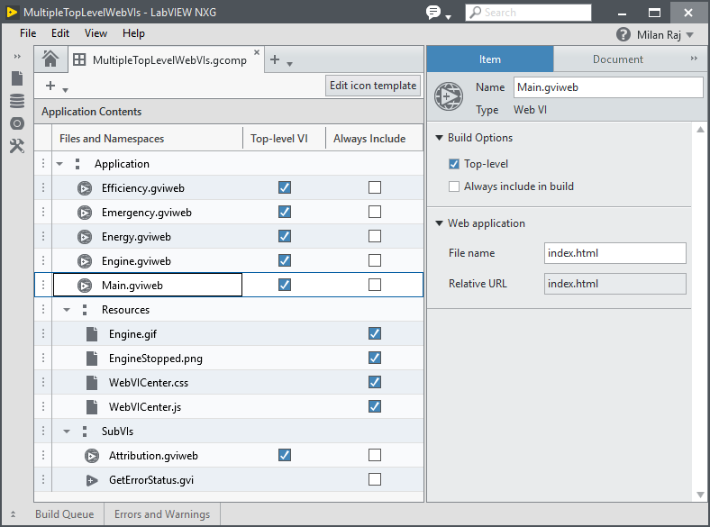

<!-- The following should be equivalent to the section in webvi-examples/Readme.md -->
# Multiple Top-Level WebVIs

This example demonstrates how to create a web application with multiple pages by using multiple top-level WebVIs and Hyperlink controls to link between them. When you build the web application, each top-level WebVI generates a separate HTML file with links to the other HTML files that are generated.

# Dependencies
- LabVIEW NXG 2.0 Web Module
- LabVIEW 2009-2017 (Required for hosting only)
- NI SystemLink Server (Required for hosting only)

# Setup
1. Clone the [ni/webvi-examples](https://github.com/ni/webvi-examples) repository to your machine.
2. Open `MultipleTopLevelVIs/MultipleTopLevelVIs.lvproject`.
3. On the **Project Files** tab, expand `WebApp.gcomp` and open `Main.gviweb`.
4. Click the **Run** button.
5. Build the web application.  
  a. On the **Project Files** tab, double-click `WebApp.gcomp` to open the web application component.  
  b. On the **Document** tab, click **Build**.  

**Note:** To view the build output on your machine, click **Locate Directory in Windows Explorer** on the **Document** tab once your application finishes building. You can automatically launch and view the Web application locally by going to **System Designer** >> **Web Server** >> right-click **WebApp.gcomp** >> **Run**

# Hosting
You can manually the move the build output found at `\MultipleTopLevelVIs\Builds` to any web server. This project also includes a Distribution (WebApp.lvdist) that can be used to build a package (.nipkg). Packages utilize NI Package Manager to automated the process of installing, upgrading, or removing the web app. A package is also a requirement for hosting a Web application on SystemLink Cloud.

## SystemLink Cloud Web App Hosting
The following steps can be used to host the web app on SystemLink Cloud
1. Open `MultipleTopLevelVIs.lvproject`.
2. Open `WebApp.lvdist`.
3. Click the build icon in the top command bar of this distribution document
4. Open a Web browser and navigate to https://systemlinkcloud.com/webapps
5. Click the **Choose nipkg** button and select the nipkg built in step 3.
6. When the upload is complete, click on your newly uploaded Web app from your list of Web apps

## Local Hosting
The following steps can be used to host the web app on a local web server
### Hosting on the NI Web Server with a nipkg
1. Open `MultipleTopLevelVIs.lvproject`
2. Open `WebApp.lvdist`.
3. Click the build icon in the top command bar of this distribution document
4. Double-click the nipkg and follow the on screen instructions
5. Open a web browser and navigate to `http://localhost:9090/incorporateuserresources/Main.html`

### Hosting on the LabVIEW 2009-2017 Web Server
1. Open `C:\Program Files (x86)\National Instruments\Shared\NI WebServer\www`.
2. Copy the `WebApp+Web Server` directory into the `www` directory.
3. Open a web browser and navigate to `http://localhost:8080/WebApp_Web%20Server/Main.html`

### Hosting on the NI Web Server
1. Open `C:\Program Files\National Instruments\Shared\Web Server\htdocs`.
2. Copy the `WebApp_Web Server` directory into the `htdocs` directory.
3. Open a web browser and navigate to `http://localhost:9090/WebApp_Web%20Server/Main.html`.

Copy and paste the build output at `\MultipleTopLevelVIs\Builds` directory to any web server you want.

## Hosting on the LabVIEW 2009-2017 Web Server
1. Open `C:\Program Files (x86)\National Instruments\Shared\NI WebServer\www`.
2. Copy the `WebApp+Web Server` directory into the `www` directory.
3. Open a web browser and navigate to `http://localhost:8080/WebApp_Web%20Server/index.html`

## Hosting on the NI Web Server
1. Open `C:\Program Files\National Instruments\Shared\Web Server\htdocs`.
2. Copy the `WebApp_Web Server` directory into the `htdocs` directory.
3. Open a web browser and navigate to `http://localhost:9090/WebApp_Web%20Server/index.html`.  

# Details

## File Name and Relative URL
Each of the top-level WebVIs generates a corresponding HTML file. The organization of the generated HTML files mirrors the hierarchy of WebVIs marked as top-level in the `WebApp.gcomp` file.

On the **Item** tab, you can change the file name for each WebVI and view the relative URL used for linking.  

Example:  

## Top-level WebVIs can be in any part of the namespace
Top-level WebVIs do not need to be at the root of the namespace. For example, `SubVIs/Attribution.gviweb` is marked as top-level and has a relative URL of `SubVIs/Attribution.html`.

## Change the File name to index.html for simpler URLs
The file name of the HTML output of a top-level WebVI does not need to match the name of the WebVI itself. For example, the file name of `Main.gviweb` is set to `index.html` rather than `Main.html`. Many static web servers automatically serve a file named `index.html` when a directory is requested, which makes for cleaner URLs. For example, on a compatible web server, a user can enter `www.example.com/MultipleTopLevelVIs/` or `www.example.com/MultipleTopLevelVIs/index.html` to view the same page.
